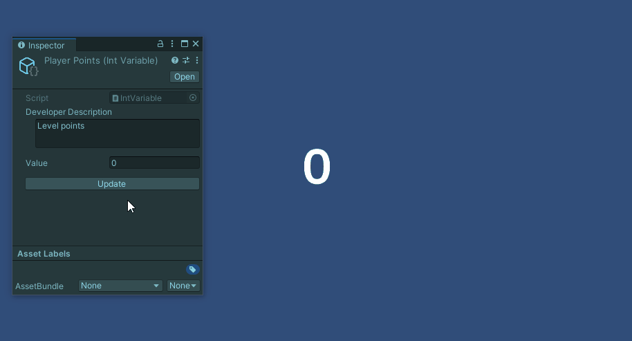

# Unity Global Variables
This project implements a global varaibles system for Unity using Scriptable Objects, allowing for easy access and management of variables across scenes scripts within the Unity Editor. Inspired by Ryan Hipple's talk [Unite Austin 2017 - Game Architecture with Scriptable Objects](https://www.youtube.com/watch?v=raQ3iHhE_Kk).

If you're interested in basing your Unity project architecture on Scriptable Objects, I recommend checking out this other project: [SO Game Events Architecture](https://github.com/DiegoRuizGil/SO-Game-Events-Architecture-Unity).


## Table of Contents
- [How to install](#how-to-install)
- [How to use](#how-to-use)
    - [Variables references](#variables-references)
    - [Global variables](#global-variables)
    - [Components variables](#components-variables)
    - [Listening for changes](#listening-for-changes)
    - [Debugging](#debugging)
- [License](#license)

## How to install
- In Unity, navigate to `Window` -> `Package Manager`
- In the Package Manager Window, click on the `+` sign in the top left corner and click on `Add Package from GIT url`
- Type the repository URL in the text box: `https://github.com/DiegoRuizGil/unity-global-variables.git`

## How to use

### Variables references
`Variable references` represent a reference to a variable, which can be a `constant`, `global variable`, or `component variable`. Users can select the variable type from the inspector.


In code, these variables can be used like any other, with available types including `bool`, `float`, `int` and `string`. To modify the value of a reference, access its `Value` attribute, but to retrie its value, simply use the reference itself (the class defines an implicit operator that returns its value).

### Global variables
Global variables are `Scriptable Objects` created within our Unity project, allowing them to be referenced from any GameObject in any scene.

To create a new variable, right click in the `Project` window and navigate to `Create` -> `Game Events`, and select the type of variable.


### Components variables
Component variables are `MonoBehaviour` scripts, meaning they can be associated with a GameObject. Unlike global variables, which are accessiable across all scenes, component variables are limited to interactions between objects within the same scene.

Using component variables can be usefull if we want ot avoid creating too many scriptable objects in our project.


### Listening for changes
When te value of a reference is updated, we can be notified using the `AddListener` function. The function passed as an argument must have a parameter of the same type as the reference, as this will be the updated value. To remove the listener, we can use the `RemoveListener` function.

```CSharp
using GlobalVariables;
using UnityEngine;

public class Test : MonoBehaviour
{
    [SerializezField]
    private IntReference _playerPoints;

    private void OnEnable() => _playerPoints.AddListener(UpdateUI);
    private void OnDisable() => _playerPoints.RemoveListener(UpdateUI);

    private void UpdateUI(int value)
    {
        ...
    }
}
```

### Debugging
You can update de value of a global or component variable by clicking on the `Update` button in the inspector. This will help in debugging whether the listeners are responding correctly, whitout requiring to execute the code needed to trigger it.




## License
This project is released under the MIT License by Diego Ruiz Gil (2024)
